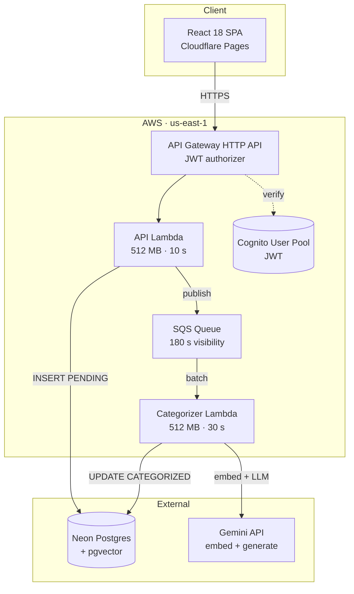

# Finance Coach LATAM

> AI-powered personal finance assistant for LATAM users.
> Production-deployed serverless on AWS + Cloudflare Pages. ~$0/month ongoing cost.

**Live demo:** [finance-coach-latam.pages.dev](https://finance-coach-latam.pages.dev)

---

## What this demonstrates

A senior backend / cloud engineer building a real production system with discipline:

- **Hexagonal architecture** (ports & adapters) — swappable LLM provider, swappable DB; composition root is the only place that touches `process.env`.
- **Async work offloading** — `POST` → API Lambda → SQS → Categorizer Lambda with built-in retry via `batchItemFailures`.
- **4-layer AI categorization cascade** with short-circuit — keyword → cache → pgvector cosine → LLM. Only the last layer touches Gemini.
- **pgvector semantic search** at 768-dim embeddings.
- **CDK Custom Resource** for migration lifecycle — schema applies automatically on every `cdk deploy`, zero manual steps.
- **Strict TDD** with work-unit commits, RED-GREEN-REFACTOR visible in `git log`.
- **Spec-Driven Development** (proposal → spec → design → tasks → apply → verify → archive).
- **Security**: Cognito JWT authorizer + owner / admin RBAC with authz-after-load pattern (no resource-existence leaks).
- **644 tests** (211 backend + 433 frontend), all green on every PR.
- **Single-stack CDK**, single-region (`us-east-1`), infra-as-code end-to-end.

---

## Architecture



**The interesting flow.** `POST /transactions` returns `201` in ~100 ms — just DB insert + SQS publish. Categorization runs asynchronously; the LLM can take 1–3 s without blocking the user. The frontend polls `GET /transactions/{id}` to detect the `PENDING → CATEGORIZED` transition and re-renders the row.

---

## The 4-layer categorization cascade

Designed for cost and latency. The cascade **short-circuits at every layer** — ~80% of real-world LATAM transactions never hit the LLM.

| Layer | Cost | Mechanism | When it runs |
|---|---|---|---|
| **L1 Keyword** | Free | Substring match against 16 hardcoded LATAM brands (`YPF`, `Netflix`, `Edesur`, `MercadoLibre`, …) | Always first |
| **L2 Cache** | 1 DB query | Lookup by normalized merchant in `merchant_category_cache` | Only if L1 misses |
| **L3 Embed + Auto-Accept** | 1 Gemini embed + 1 pgvector query | Compute 768-dim vector, cosine distance top-5, auto-accept if `top1.distance < top2.distance * 0.5` | Only if L2 misses |
| **L4 LLM Ambiguity** | 1 Gemini Flash call | Receives top-5 IDs + names + slugs as context, returns one UUID | Only if L3 is ambiguous |

The merchant cache is **write-through**: every successful categorization (L1, L3, L4) writes back. The second transaction for the same merchant is free.

---

## Stack

| Layer | Tech |
|---|---|
| Frontend | React 18 · Vite · TypeScript (strict) · Tailwind 3 · Atomic Design |
| Backend | Node 24 · TypeScript · esbuild · Vitest |
| Architecture | Hexagonal (domain / application / infrastructure / interfaces) |
| Database | Neon Postgres + `pgvector(768)` · Drizzle ORM |
| LLM | Gemini Flash (`generateText`) · Gemini Embedding 001 (`embed`) |
| API | API Gateway HTTP API v2 · JWT authorizer |
| Async | SQS + Lambda event-source mapping · `batchItemFailures` retry |
| Auth | Cognito User Pool · owner / admin RBAC · authz-after-load |
| IaC | AWS CDK v2 (TypeScript) · single stack |
| Frontend hosting | Cloudflare Pages · auto-deploy on `main` |
| Testing | Vitest · MSW · Testing Library · 644 tests |

---

## Run it locally

```bash
# Backend
cd backend
npm install
cp .env.example .env             # fill DATABASE_URL
npm run db:generate && npm run db:migrate
npm run build && npm run dev

# Frontend (separate terminal)
cd frontend
npm install
npm run dev                      # http://localhost:5173

# Tests
cd backend  && npm test          # 211 tests
cd frontend && npm test          # 433 tests
```

See [`frontend/RUNBOOK.md`](./frontend/RUNBOOK.md) for env vars, deploy procedure, and operational constraints.

---

## Cost reality

Every service is on a free tier sized for a recruiter-demo workload:

| Service | Free tier | Notes |
|---|---|---|
| Cloudflare Pages | Unlimited bandwidth · 500 builds / mo | Static SPA |
| AWS Lambda | 1 M req / mo · 400 K GB-s compute | Always free |
| SQS | 1 M req / mo | Always free |
| API Gateway HTTP API | 1 M req / mo first 12 mo | ~$0.04 / yr after — effectively $0 |
| Cognito | 50 K MAU | Always free for a demo |
| Neon Postgres | 0.5 GB storage · 191.9 compute hrs / mo | Auto-suspends after 5 min idle |
| CloudWatch Logs | 5 GB ingest + 5 GB storage | 7-day retention configured |

Practical estimate: **$0 – $0.50 / year** at demo traffic.

---

## Quality signals

- **644 tests** passing on every PR (Vitest backend + Vitest + MSW + Testing Library frontend).
- `tsc --noEmit` clean on both projects.
- `cdk synth` clean.
- Cloudflare Pages auto-deploys on every `main` push.
- Zero secrets in the repo (SSM Parameter Store at deploy time).
- Conventional commits, work-unit atomic commits — `git log` reads as a story.

---

## Intentional out-of-scope

- Multi-region (single `us-east-1`).
- Production observability stack (CloudWatch defaults only).
- CI/CD with OIDC federation (planned).
- Mobile native apps (responsive web only).
- Real bank integrations (manual entry only).
