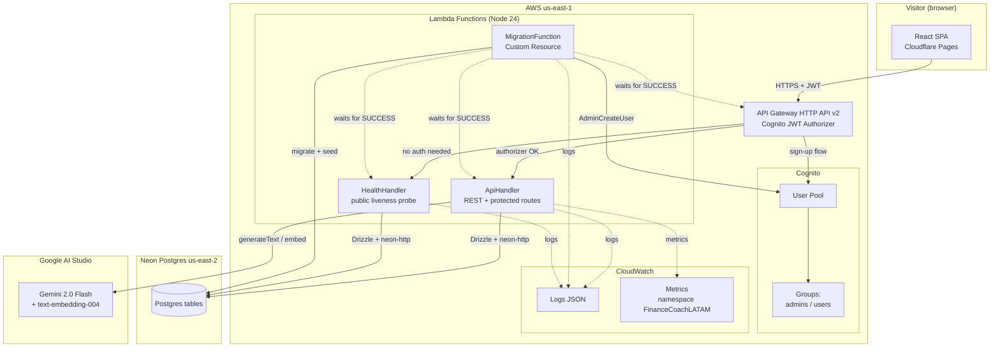

# Design — Personal Finance Coach for LATAM

## Architecture overview

The `MigrateAndSeed` Custom Resource (not shown explicitly; backed by `MigrationFunction`) runs **before** `ApiHandler`, `HealthHandler`, and the API Gateway itself, thanks to `node.addDependency()` calls in the CDK stack.

## Component map

### AWS resources (defined in `infra/lib/finance-coach-stack.ts`)

| Construct ID | Type | Purpose |
|---|---|---|
| `FinanceCoachStack` | `cdk.Stack` | Single stack, region `us-east-1` |
| `FinanceCoachUserPool` | `cognito.UserPool` | Email + password auth, no Hosted UI |
| `FinanceCoachUserPoolClient` | `cognito.UserPoolClient` | For direct JWT authentication |
| `UserPoolGroupadmins` / `UserPoolGroupusers` | `cognito.CfnUserPoolGroup` | Role segregation |
| `FinanceCoachCognitoAuthorizer` | `apigwv2.CognitoUserPoolAuthorizer` | Validates JWT on protected routes |
| `ApiHandler` | `lambda.Function` | Handles all authenticated routes (users, accounts, categories, transactions) |
| `HealthHandler` | `lambda.Function` | Handles `/health` unauthenticated |
| `MigrationFunction` | `lambda.Function` | Custom Resource: migrations + seed + Cognito bootstrap |
| `FinanceCoachHttpApi` | `apigwv2.HttpApi` | Public HTTP API v2 |
| `MigrateAndSeed` | `cdk.CustomResource` | Triggers `MigrationFunction` on every deploy |
| `MigrationProvider` | `cr.Provider` | SNS-backed provider for the Custom Resource |
| `FinanceCoachApiUrl` | `CfnOutput` | API endpoint for the demo |
| `UserPoolId` / `UserPoolClientId` | `CfnOutput` | For frontend integration |

### Lambda functions

- **ApiHandler** (`backend/src/lambdas/api/composition.ts`) — composed root for the authenticated REST API. Routes through `users.routes.ts`, `accounts.routes.ts`, `categories.routes.ts`, `transactions.routes.ts`.
- **HealthHandler** (`backend/src/main.ts`) — public liveness probe. Two endpoints: `POST /health` (insert), `GET /health` (list).
- **MigrationFunction** (`backend/src/lambdas/migration/composition.ts`) — CloudFormation Custom Resource. Runs migrations, seed, and Cognito user bootstrap on every deploy.

### Database schema (Drizzle, in `backend/src/infrastructure/database/drizzle/schema.ts`)

| Table | Purpose | Columns |
|---|---|---|
| `health_check` | POC connectivity table | `id`, `name`, `createdAt` |
| `user` | Cognito user mirror | `id`, `email`, `name`, `tier`, `createdAt` |
| `account` | Bank account / payment method | `id`, `userId`, `name`, `type`, `createdAt` |
| `category` | Transaction categories | `id`, `slug` (unique), `name`, `color` |
| `transaction` | Core entity | `id`, `userId`, `accountId`, `categoryId`, `merchant`, `amount` (int cents), `occurredAt`, `status`, `notes`, `createdAt` |
| `drizzle.__drizzle_migrations` | Drizzle tracking | (managed by Drizzle) |

### API routes

| Route | Method | Auth | Handler |
|---|---|---|---|
| `/health` | GET, POST | None | `health.handler.ts` |
| `/users` | POST, GET | Cognito JWT + admin group | `users.routes.ts` |
| `/accounts` | POST, GET | Cognito JWT | `accounts.routes.ts` |
| `/categories` | GET | Cognito JWT | `categories.routes.ts` |
| `/transactions` | POST, GET | Cognito JWT | `transactions.routes.ts` |
| `/transactions/{id}/categorize` | POST | Cognito JWT | `transactions.routes.ts` |

## Architectural decisions

The decisions are documented as ADRs under `docs/architecture/decisions/`. The most important ones:

### ADR-001 — CloudFormation Custom Resource for DB migrations

**Status:** Accepted · **Date:** 2026-07-30

**Context.** We need automated DB schema management on every AWS deploy. Manual `npm run db:migrate` before deploy is error-prone and not auditable. Migrations in app code (init Lambda) have race conditions. GitHub Actions as a separate step requires CI setup that comes later.

**Decision.** Use a CloudFormation Custom Resource backed by a Lambda (`MigrationFunction`) to run Drizzle migrations and idempotent seed on every `cdk deploy`. The Custom Resource is wired with `node.addDependency()` so the API Lambda and API Gateway are only created after migration success.

**Consequences.**

- ✅ Every deploy runs migrations + seed automatically
- ✅ Stack rollback if migration fails (CloudFormation native behavior)
- ✅ Visible in CloudFormation as a resource (audit trail)
- ✅ Idempotent: Drizzle tracks via `__drizzle_migrations`; seed uses query-first
- ⚠️ Lambda timeout must accommodate migrations (set to 2 minutes)
- ⚠️ Migrations folder must be bundled with the Lambda (esbuild post-step copies it)

### ADR-002 — Hexagonal architecture over NestJS

**Status:** Accepted · **Date:** 2026-07-30

**Context.** NestJS would provide DI and structure but adds 30–50 MB to the bundle and a heavy runtime for what is essentially 3 Lambdas with 6 use cases. Plain controllers would couple handlers to DB and LLM directly, breaking testability.

**Decision.** Hexagonal architecture (ports and adapters) with shared `domain/` / `application/` / `infrastructure/` / `interfaces/` layers. Per-Lambda entry points in `src/lambdas/{name}/composition.ts`.

**Consequences.**

- ✅ Use cases depend only on `DatabasePort` and `LLMPort` interfaces
- ✅ 100% unit test coverage on use cases without touching DB or external APIs
- ✅ Bundle stays at ~350 KB (vs ~50 MB with NestJS)
- ✅ Swap Neon → DynamoDB or Gemini → OpenAI by changing one file (the factory)
- ⚠️ More upfront architecture effort than a controller-per-endpoint style
- ⚠️ Junior devs may struggle with the abstractions (acceptable trade-off for senior-targeted portfolio)

### ADR-003 — Drizzle ORM with `neon-http` driver

**Status:** Accepted · **Date:** 2026-07-30

**Context.** Need a TypeScript ORM that works with Neon Postgres. Options: Prisma (mature, binary runtime, heavier), Drizzle (SQL-like, lightweight, programmatic migrator), raw SQL (too low-level).

**Decision.** Drizzle ORM with the `@neondatabase/serverless` HTTP driver. Migrations generated programmatically, not via CLI. Single-table or multi-table design supported; we use multi-table for clear entity boundaries.

**Consequences.**

- ✅ Bundle stays small (Drizzle is ~50 KB minified)
- ✅ No VPC, no NAT, no connection pooler (HTTP driver works over HTTPS)
- ✅ Programmatic migrator lets the Custom Resource Lambda drive migrations
- ✅ Schema-as-code with full TypeScript inference
- ⚠️ Drizzle puts `__drizzle_migrations` in the `drizzle` schema (not `public`) — required schema-qualified queries
- ⚠️ Migrator requires `{migrationsFolder}` object, not a string — gotcha documented in code comments

### ADR-004 — Gemini 2.0 Flash free tier over paid OpenAI/Anthropic

**Status:** Accepted · **Date:** 2026-07-30

**Context.** AI integration for transaction categorization. Paid tiers (OpenAI, Anthropic) require cards and ongoing spend. Gemini free tier (15 RPM, 1,500 RPD, 1M tokens/min) covers portfolio demo with zero ongoing cost.

**Decision.** Use Gemini 2.0 Flash via Google AI Studio for both `generateText` and `text-embedding-004`. Adapter is behind `LLMPort` so swapping to OpenAI/Anthropic later requires only adding an adapter and changing `LLM_PROVIDER` env var.

**Consequences.**

- ✅ $0 ongoing cost for typical demo traffic
- ✅ Direct API access (no SDK bloat)
- ✅ Swappable architecture already in place
- ⚠️ Free tier can be exhausted if demo gets viral traffic — must rate-limit on frontend
- ⚠️ Quota changes from Google could break the demo — mitigated by fallback architecture

### ADR-005 — Two roles only (admin + user)

**Status:** Accepted · **Date:** 2026-07-30

**Context.** RBAC design choice. Could have used more granular roles (admin, ops, auditor, user, viewer, etc.) or hierarchical roles with permission sets.

**Decision.** Only two roles: `admin` and `user`. Admin sees everything and can create/manage users. User sees only their own data. RBAC enforced at the Lambda handler level via `assertCanActAs(actor, target)` helper.

**Consequences.**

- ✅ Simpler permission model, easier to explain in interviews
- ✅ Less surface to test (only 2 role × 2 access patterns)
- ✅ Matches the user-facing story: "I'm a person using the app" vs "I'm the company's ops person"
- ⚠️ No room for "read-only" or "auditor" roles if the product needs them later — easy to add later, but redesign the JWT claims
- ⚠️ Admin impersonation is possible (admin can act as any user) — acceptable for portfolio demo, document in security.md